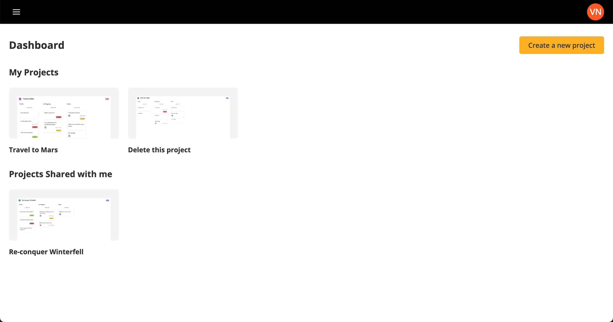
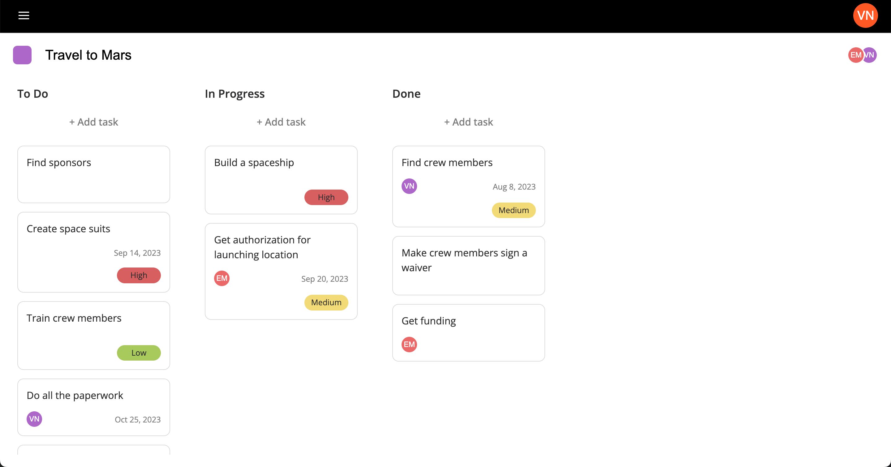

# Collaborate

## What is Collaborate

Collaborate is a project management web application. You can create Kanban boards that allows team members to visualize all the tasks related to a project and track the progress along the way. The team will be able to collaborate in real time.

### Main Technologies

- React
- Node.js
- Express.js
- Socket.io
- MongoDB

### Interesting Supportive Technologies

- Mui
- Styled-components
- React-beautiful-dnd - A package to enable the drag-n-drop functionality
- Html2canvas - A package to take screenshots
- Auth0

### Interesting Features

- Create, edit and delete projects.
- Drag-and-drop tasks from one column to the other.
- A screenshot of the project is used as the project thumbnail in the dashboard.
- Manage team members within each project.
- Live collaboration with other team members via socket.io
- Authentification required to access the frontend but also the backend.

## Getting Started

### Backend

- Run `yarn install` in the server directory to install the necessary packages related to the backend.
- Run `yarn start` to start the backend server, again from the server directory.

### Frontend

- Run `yarn install` in the client directory to install the necessary packages related to the frontend.
- Run `yarn start` to start the frontend on a localhost, again from the client directory.

### Setting up the environment

You will find example files of .env in both frontend and backend directories. You will have to fill-in each variable with the proper credential.

## Screenshots

### Dashboard

### Project Page
